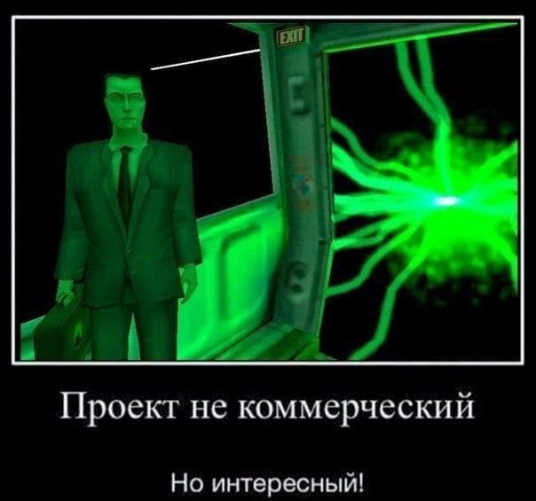

# О проекте


Дизайн-документ: [link](doc/DESIGN.md)

# Сборка и запуск

Запустить на NixOS:
```
nix run github:game123lol/game123
```
Запустить при помощи nix на другом дистрибутиве linux:
```
nix run --override-input nixpkgs nixpkgs/nixos-23.05 --impure github:guibou/nixGL -- \
  nix run github:game123lol/game123
```
Сборка из исходного кода:
```
git clone https://github.com/game123lol/game123
cd game123
cargo run --release
```
Для сборки нужны pkg-config, SDL2, CMake и alsalib
